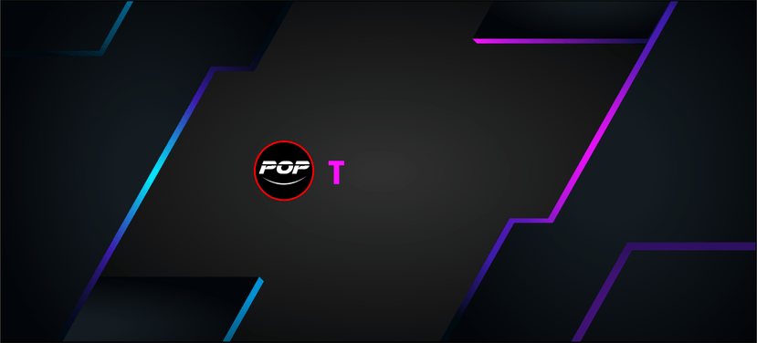

  

  <h1>"I'm Programmer and I'm Gamer, So I'm ProGamer"</h1>

  

    
    
  

---

## 🎮 Gaming & Chill

  

  

  

  

  

  

  

---

## 💻 Languages

---

## ⚙️ Frameworks

---

## 📚 Libraries

---

## 🗄️ Database

---

## 🛠️ Tools & Environment

---

## 💿 OS

---

## 🌍 Browser

---

## 🎨 Other Skills

